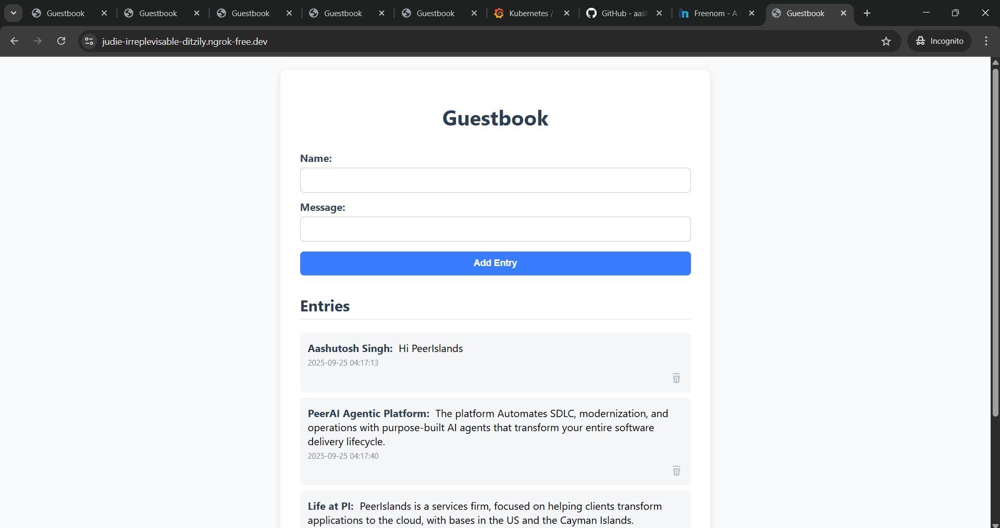

# PeerIslands DevOps Assignment – Guestbook Application

This project demonstrates the **end-to-end DevOps lifecycle** for deploying a microservice-based application on **Azure Kubernetes Service (AKS)** using modern DevOps practices.

The solution provisions infrastructure with **Terraform**, ensures security compliance with **Checkov**, builds and secures containerized applications, automates deployments via **Azure Pipelines & Helm**, and integrates **Prometheus + Grafana** for monitoring and reporting.

---

## 🔹 Architecture Overview

* **Infrastructure (Terraform)**

  * AKS Cluster
  * Azure Container Registry (ACR)
  * Key Vault for secret management
  * Virtual Network + Subnet
  * Role-based Access Control (RBAC)

* **Application (Microservices)**

  * **Frontend** → Nginx serving HTML/JS, proxying requests
  * **Backend** → FastAPI (Python) exposing REST APIs
  * **Database** → Redis for guestbook storage
  

* **Deployment (On AKS via Helm)**

  * Kubernetes manifests templated via Helm chart
  * Separate Deployments & Services for frontend, backend, redis
  * Frontend exposed via `LoadBalancer`
  
  

* **CI/CD (Azure Pipelines)**

  * **Terraform Stage** → Validate, Scan (Checkov), Plan, Apply
  * **Build Stage** → Docker build, Trivy scan, push images to ACR
  * **Deploy Stage** → Helm upgrade/install to AKS
  * Rollout verification with `kubectl`
  
  
  

* **Monitoring (Prometheus + Grafana)**

  * Metrics: CPU, Memory, Latency, Error Rates
  * Daily dashboard exports for performance reporting
  * Deployed on AKS using helm charts.
  

---

## 🔹 Key Features

* **Infrastructure as Code** with Terraform (secure, repeatable provisioning)
* **Security scanning** integrated (Checkov + Trivy)
* **Microservices architecture** (frontend + backend + database)
* **Helm-based deployment** for modular, environment-ready configs
* **CI/CD automation** with Azure Pipelines
* **Cluster & app monitoring** with Prometheus & Grafana

---

## 🔹 Deliverables

* GitHub Repo containing:

  * Terraform code (`terraform/`)
  * Application code (`app/`)
  * Helm chart (`helm/guestbook/`)
  * Azure Pipeline config (`.azure-pipelines/`)
  * Reports: Checkov scan results, Grafana snapshots (`reports/`)
* Running application on AKS (frontend exposed via LoadBalancer)
* Monitoring dashboards with performance metrics
* Documentation of setup, assumptions, and design decisions
