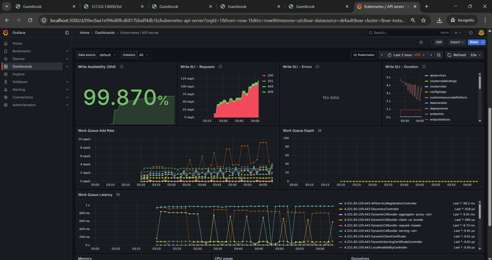
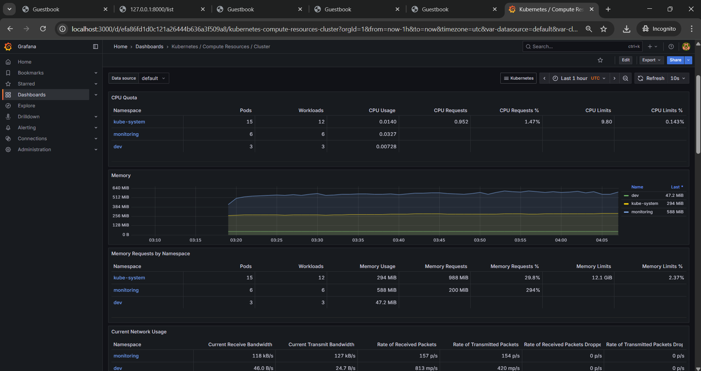
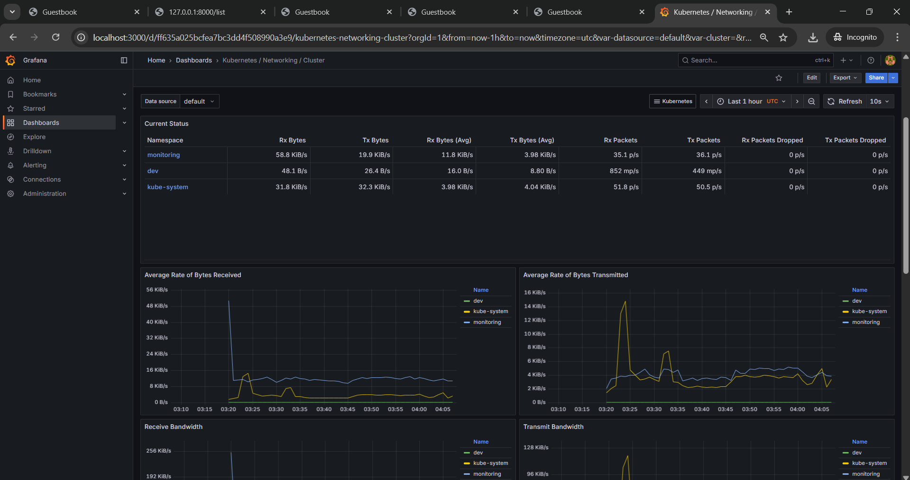
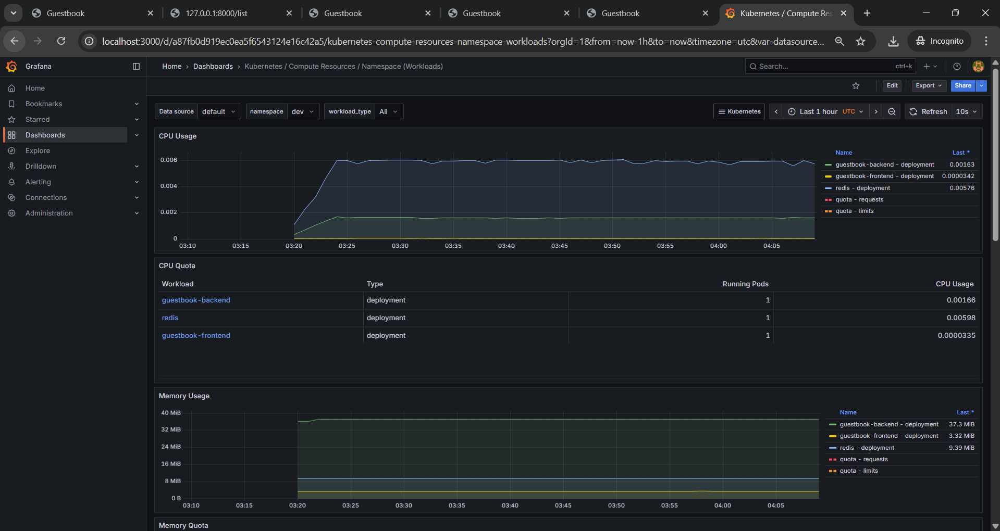
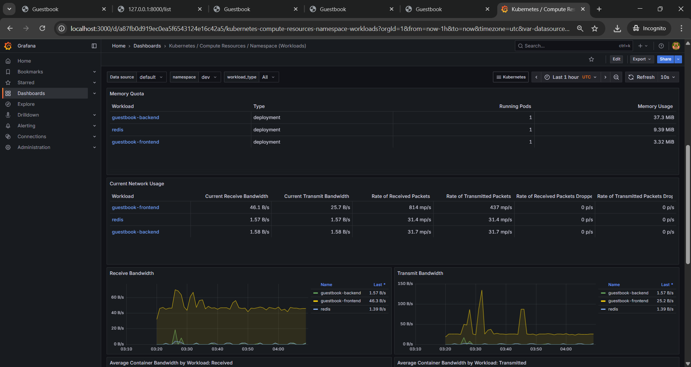

# Monitoring Setup – Prometheus & Grafana

This document explains how Prometheus and Grafana were set up on the AKS cluster using Helm to provide monitoring and visualization for the deployed microservices (backend, frontend, redis).

---

## Overview
- We used the **kube-prometheus-stack** Helm chart from the `prometheus-community` repository.
- The stack includes **Prometheus, Grafana, Alertmanager** and Kubernetes exporters.
- Installed in the dedicated namespace: `monitoring`.
- Grafana dashboards are used to visualize:
  - Cluster CPU and memory usage
  - Pod restarts and resource consumption
  - HTTP request count, latency, and errors

---

## Setup Steps

### 1. Add Helm Repository
```bash
helm repo add prometheus-community https://prometheus-community.github.io/helm-charts
helm repo update
```
### 2. Install kube-prometheus-stack

```bash
helm upgrade --install monitoring prometheus-community/kube-prometheus-stack \
  --namespace monitoring \
  --create-namespace \
  --set grafana.adminPassword=admin123 \
  --set prometheus.service.type=ClusterIP \
  --set grafana.service.type=ClusterIP
```

* `grafana.adminPassword`: Default password for Grafana admin user.
* `service.type`: Set to `ClusterIP` for internal access. Port-forward used for assignment.

### 3. Access Grafana

```bash
kubectl port-forward svc/monitoring-grafana -n monitoring 3000:80
```

Open [http://localhost:3000](http://localhost:3000)
Login with:

* Username: `admin`
* Password: `admin123`

### 4. Dashboards

* Default dashboards included in kube-prometheus-stack:

  * Kubernetes / Compute Resources / Cluster
  * Kubernetes / Compute Resources / Namespace (Pods)
  * Kubernetes / API Server
* Additional dashboards can be imported via Grafana UI.

---

## Reports

### Screenshot – Cluster Monitoring







### Screenshot – Guestbook Application Dashboard




---

## Deliverables

* Helm installation commands and configuration
* Grafana dashboards showing:

  * Cluster resource usage
  * Application request metrics
* Screenshots saved in `reports/` directory
