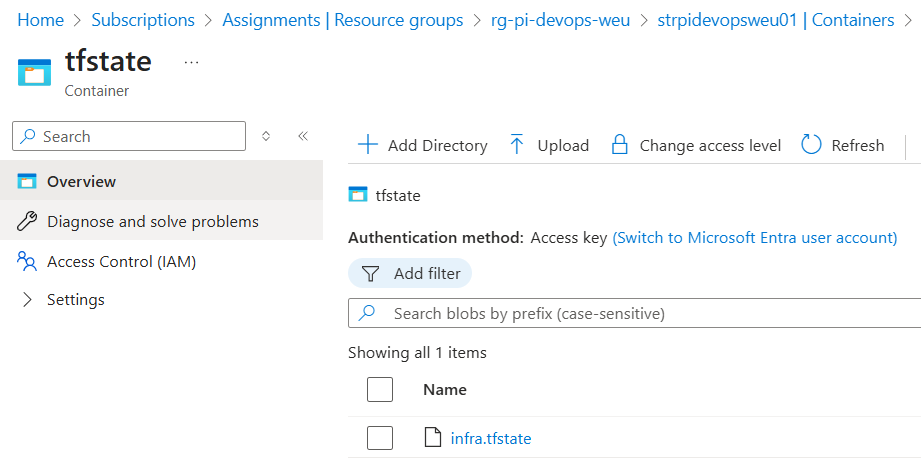

# Terraform – Infrastructure

## Overview
This folder contains Terraform code to provision a production-like environment on **Azure**.  
It sets up the core infrastructure services and resources required for running the Guestbook application on **Azure Kubernetes Service (AKS)**.

---

## Resources Created
- **Resource Group** – logical container for all resources.
- **Virtual Network + Subnet** – provides private networking for AKS.
- **Azure Container Registry (ACR)** – stores Docker images for backend and frontend.
- **Azure Key Vault** – secure storage for secrets.
- **AKS Cluster** – Kubernetes cluster with:
  - System-assigned managed identity.
  - RBAC enabled.
  - Autoscaling enabled (min 1 node, max 5 nodes).
  - Azure CNI and Network Policy enabled.
- **Role Assignment** – grants AKS permissions to pull images from ACR.

---

## Key Points
1. **Remote State**  
   The Terraform state is stored in an **Azure Storage Account** and container created beforehand and create the **backend.tf** from example.  
   This allows collaboration and state consistency across runs.

2. **Variables**  
   - `terraform.tfvars` is not committed (contains sensitive values).
   - Example file provided: `terraform.tfvars.example`.
   - Tags are passed as a map and applied consistently to all resources.

3. **Security**  
   - Key Vault has purge protection and soft-delete enabled.
   - ACR does not expose admin credentials (admin disabled).
   - AKS uses managed identity for integration.

4. **Scalability**  
   - AKS node pool is configured with **autoscaling** (1–5 nodes).
   - VM size can be customized via variables.

---

## Usage

### 1. Initialize
```bash
terraform init
```
### 2. Plan
```bash
terraform plan -out tfplan
```
### 3. Apply
```bash
terraform apply "tfplan"
```
### 4. Destroy
```bash
terraform destroy -auto-approve
```
## Notes

- Ensure Azure CLI is authenticated (az login) before running Terraform.

- Make sure to add backend.tf as described in example to remotely access a collaborative project with having respective roles and permissions.

- Review Checkov/Terrascan output to validate infrastructure security posture.